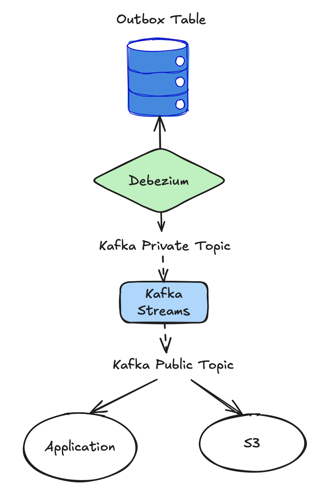

# Conduit

This project implements an **event-driven outbox pattern** using Kafka, Debezium, Kafka Streams, and Schema Registry to propagate state changes from a PostgreSQL-based microservice into a shared, normalized event stream that can be consumed by downstream services (e.g., shipment service, S3 sinks, etc.).

## ✨ Why Conduit?
- **Decouple producers from consumers** — expose a stable, versioned public contract.
- **Normalize change events** — transform raw CDC JSON into Avro records.
- **Guarantee compatibility** — enforce schemas via Confluent Schema Registry.
- **Polyglot friendly** — consumers only need the Avro schema, not internal DB details.

## 🏗 Architecture Overview


- **Debezium** monitors changes in the outbox table (`outboxevent`) via logical decoding.
- **Kafka Streams** normalizes and transforms the private JSON-based stream to a public Avro-based stream.
- **Schema Registry** ensures schema evolution and validation.
- **Consumers** (e.g., shipment-service) deserialize strongly typed Avro messages.


## 🔧 Modules

| Module              | Description |
|---------------------|-------------|
| `order-service`     | Produces domain events into the `outboxevent` table (CDC source). |
| `debezium`          | PostgreSQL connector with logical decoding. |
| `kafka-streams`     | Reads from private JSON topic, normalizes into typed Avro records. |
| `shipment-service`  | Sample consumer of the public outbox stream using Specific Avro. |


## 🧠 Key Concepts

### 🔁 Outbox Pattern
- Ensures reliable propagation of domain events by writing to an outbox table as part of the local transaction.
- Eliminates dual-write problems between DB and Kafka.

### 🧬 Schema Evolution with Avro
- Versioned topics (`orders.public.outbox.v1`) separate schema contracts.
- Avro ensures serialization compatibility with enforced schema types.

### 🔍 Change Data Capture (CDC)
- Debezium reads logical changes using PostgreSQL's logical replication.
- Handles special PostgreSQL cases like TOAST columns:
    - See [Handling Unchanged TOAST Values](https://debezium.io/blog/2019/10/08/handling-unchanged-postgres-toast-values/)

### 📦 Event Routing and Transformation
- Debezium connector transforms the CDC stream:
    - `ExtractNewRecordState` to unwrap payloads
    - `ByLogicalTableRouter` to rename topics
- Kafka Streams performs final enrichment and emits versioned Avro events.


## 🚦 Key Behaviors

- **Null or `__debezium_unavailable_value` fields** are filtered to prevent deserialization failures.
- **Consumers** can independently subscribe to public topics without breaking changes via Avro + topic versioning.
- **Tombstones** can be handled if `tombstones.on.delete=true`, though dropped by default.


## 🧪 Running Locally

```bash
make up
```

Then, interact via:

- `localhost:8080` → Order service API
- `localhost:8091` → Shipment service consumer logs

## 🛠️ Generating Avro POJOs

To generate Java POJOs from your Avro schema files, run:

```bash
mvn generate-sources
```


## 📚 References

- [The Schema Registry API is *Not* How You Use Schema with Kafka](https://medium.com/google-cloud/the-schema-registry-api-is-not-how-you-use-schema-with-kafka-3adb92f09764)
- [Is Kafka a Database (with ksqlDB)?](https://www.confluent.io/blog/is-kafka-a-database-with-ksqldb/)
- [Database Inside Out – Martin Kleppmann](https://martin.kleppmann.com/2015/11/05/database-inside-out-at-oredev.html)
- [Handling Unchanged Postgres TOAST Values](https://debezium.io/blog/2019/10/08/handling-unchanged-postgres-toast-values/)
- [Debezium PostgreSQL Connector Docs](https://debezium.io/documentation/reference/stable/connectors/postgresql.html)


## 📝 Future Enhancements

- Add schema validation and metrics.
- Implement event reprocessing and dead-letter handling.
- Enable S3 archival via Kafka Connect + LocalStack.
- Integrate observability with Prometheus and Micrometer.
